# SCUnirea：一站式校園課程資訊與修業學習管理系統 (Systems Analysis & Architecture Design)

[](#)
[](#)
[](#)
[](#)

> **課程專題**：系統分析與設計 (Systems Analysis and Design) ｜ **指導教授**：林娟娟 教授  
> **專案小組成員**：廖冠筑、簡偉玲、洪語欣、洪于茜、盧恩佳  
> **個人核心職責 (20.5%)**：初步調查報告 (PIR)、功能分解 (FDD)、環境圖 (Context Diagram)、評價評論系統完整規格 (Process 4 DFD/DD/Figma 原型)、課程查詢系統 (Process 5 DFD)、關聯資料庫架構重構與第三正規化實作 (3NF ERD / SNTL / Access 資料表)

---

## 📌 專案背景與痛點分析 (Problem Statement & PIR)
針對大學生選課時面臨的「授課風格不透明、修業學分規劃混亂、各科作業行程散落多平台」等痛點，本專案運用結構化分析與設計方法（Structured Analysis），規劃一站式校園課程學習管理平台 **SCUnirea**：
* **資訊破碎化**：整合教務系統、校外非正式評價、各科課堂大綱與即期作業日程。
* **三端角色權限隔離 (RBAC)**：精確劃分「學生端 App、教師端工作台、校方行政後台」之資料存取權限與系統邊界。
* **雙向回饋與合規管理**：設計 4 大維度量化指標（甜度、風格、內容、氣氛）供學生客觀評分，並建構「教師實名回覆」與「校方違規言論隱蔽下架」機制，兼顧發言自由與內容審核合規性。

---

## 🏛️ 系統全域架構與資料流程 (System Hierarchy & DFD)

系統歷經需求調研、功能分解，繪製完整的 Context Diagram、Diagram 0 及 7 大子系統之階層式資料流程圖（DFD）：

```mermaid
%%{init: {'theme': 'base', 'themeVariables': { 'primaryColor': '#F0F9FF', 'edgeLabelBackground':'#FFFFFF', 'primaryBorderColor': '#0284C7', 'lineColor': '#0369A1'}}}%%
flowchart TD
    subgraph Entities ["👥 外部實體 (External Entities)"]
        E1["🎓 學生端 (Student)"]
        E2["👨‍🏫 教師端 (Faculty)"]
        E3["🏫 校方行政後台 (Admin Console)"]
        E4["📅 Google 行事曆 (External API)"]
    end

    subgraph Core ["🔄 SCUnirea 核心處理系統 (Sub-processes)"]
        P1["1.0 權限管理系統<br/>(帳號驗證 · 名單批次匯入)"]
        P2["2.0 課程管理系統<br/>(開課審核 · 資訊整合)"]
        P3["3.0 課程資訊系統<br/>(公告發布 · 待辦事項清單)"]
        P4["4.0 評價評論系統 ⭐<br/>(多維度評分 · 雙向回覆 · 官方隱蔽)"]
        P5["5.0 課程查詢系統 ⭐<br/>(系級篩選 · 條件權重排序)"]
        P6["6.0 修課規劃系統<br/>(願望清單 · 畢業學分計算)"]
        P7["7.0 行事曆管理系統<br/>(排程生成 · Google Calendar 匯出)"]
    end

    subgraph Storage ["🗄️ 核心資料儲存 (Data Stores)"]
        D1[("D1 使用者帳號庫")]
        D2[("D2 學生修課紀錄")]
        D3[("D3 課程資訊總表")]
        D4[("D4 課程活動清單")]
        D5[("D5 課程公告紀錄")]
        D6[("D6 課程評價評論庫 ⭐")]
        D7[("D7 課程收藏清單")]
    end

    E1 <--> P4 & P5 & P6 & P7 & P3
    E2 <--> P2 & P3 & P4 & P7
    E3 <--> P1 & P2 & P4 & P5
    P7 --> E4

    P1 --- D1 & D2
    P2 --- D3
    P3 --- D4 & D5
    P4 --- D6
    P5 --- D3 & D6
    P6 --- D2 & D3 & D7
    P7 --- D2 & D3 & D4

    classDef entityBox fill:#E0F2FE,stroke:#0284C7,stroke-width:1.5px,color:#0C4A6E,rx:8px,ry:8px;
    classDef processBox fill:#F8FAFC,stroke:#334155,stroke-width:1.5px,color:#0F172A,rx:8px,ry:8px;
    classDef myProcess fill:#FEF3C7,stroke:#D97706,stroke-width:2px,color:#78350F,rx:8px,ry:8px;
    classDef storeBox fill:#F1F5F9,stroke:#64748B,stroke-width:1.5px,color:#1E293B,rx:6px,ry:6px;

    class E1,E2,E3,E4 entityBox;
    class P1,P2,P3,P6,P7 processBox;
    class P4,P5 myProcess;
    class D1,D2,D3,D4,D5,D6,D7 storeBox;
```



---

## 🛠️ 個人核心模組深鑽 (Individual Focus & Deliverables)

### 1. 評價評論子系統 (Process 4.0 Detailed DFD & Spec)
* **多層級資料流切分**：展開至 Level-2 細部流程，包含 `4.1 匯入評價評論`、`4.2 條件篩選`、`4.3 查閱授權`、`4.4 多條件排序`、`4.5 教師實名回覆處理`、`4.6 編輯與刪除`、`4.7 官方不當言論隱蔽處置`。
* **量化指標與結構化辭典 (Data Dictionary)**：精確定義 `甜度`、`教學風格`、`內容取向`、`課堂氣氛` 等 4 大評分維度（1~5 分整數型態），並針對學生長文字評論輸入進行字數長度約束與防呆規範。

### 2. 課程多條件查詢與排序引擎 (Process 5.0 DFD)
* **預設個人化載入**：串接 `D2 學生修課紀錄`，於首頁依學號自動過濾已修過之課程。
* **動態加權運算**：設計 `5.4 計算課程總評價`，將篩選後的候選課程依星級評分、熱門度與系級選別動態回傳排序結果。

### 3. 第三正規化資料庫重構 (Database Schema Refactoring to 3NF)
在架構設計初期，團隊為落實正規化曾拆分出多張 1:1 表。經評估高併發查詢時 `JOIN` 帶來的額外運算開銷後，主動進行 **Schema Refactoring（架構重構）**，將強相依屬性整併回主實體，消除非必要之 1:1 冗餘，建立高內聚、低耦合的 3NF 關聯模型：

```text
-- 第三正規化標準表示法 (Standard Notation Format Table List)
使用者資料 (學號/人事代碼, 姓名, 帳號, 密碼, 身分)
課程資訊 (課程代碼, 課程名稱, 課程資訊, 學分, 開課狀態, 開課班級, 選別)
開課 (課程代碼, 學號/人事代碼, 教室, 時間)
修課紀錄 (課程代碼, 學號/人事代碼)
評價評論 (課程代碼, 學號/人事代碼, 評論時間, 甜度, 教學風格, 內容取向, 課堂氣氛, 評論, 評論回覆)
公告資訊 (公告名稱, 內文)
公告紀錄 (課程代碼, 公告名稱, 公告時間)
活動資訊 (活動代碼, 活動名稱, 活動內容, 活動屬性, 活動開始日, 活動截止日)
活動紀錄 (活動代碼, 課程代碼)
```
*(全表皆滿足 3NF，無部分相依與遞移相依，並完整落實外部鍵參照完整性)*

---

## 📱 三端介面原型設計與使用者旅程 (Figma UI/UX Prototype)

涵蓋 **學生端 App**、**教師端工作台** 與 **校方管理後台**，打造完整的校園服務閉環：

### 1. 學生端核心流程 (Student App)
| 課程複合條件搜尋引擎 | 評價評論與量化指標填寫 | 畢業學分審查試算 |
| :---: | :---: | :---: |
|  ||  |
| 依科系、年級、選別即時檢索 | 提供甜度等五星量化指標與評論分享 | 自動比對已修/未修學分，防止缺學分延畢 |

### 2. 教師端工作台與互動 (Faculty Portal)
* **開課申請提交**：教師在線填報科目資訊、排定時段與教室，並上傳授課計畫書。
* **課堂活動指派**：即時發布公告與課程活動（作業/考試/報告），自動同步至修課學生之待辦清單。
* **教學回饋互動**：針對學生的課程評價進行實名回應，促進良性教學溝通。

### 3. 校方行政後台管理系統 (Admin Console)
* **批次權限匯入 (Process 1.0)**：支援學期初全校學生與教職員帳號名單批次匯入，並處理停權與退學資料維護。
* **開課審查系統 (Process 2.0)**：行政人員線上審核教師提交之開課申請、檢查授課計畫書並核配資源。
* **違規評價隱蔽處置 (Process 4.7)**：落實內容治理機制，針對惡意人身攻擊或不實評論執行官方隱蔽下架。

---

## 🗄️ 資料庫實體關聯模型與實作 (Database Implementation)

| 實體關聯模型設計 (ERD) | MS Access 第三正規化資料表關聯實作 |
| :---: | :---: |
|  |  |
| 定義實體間之 1:N 與 M:N 解耦關係 | 消除 1:1 冗餘表，建立標準 $1 \to \infty$ 參照完整性約束 |

---

## 📑 專案收穫與工程思維沉澱 (Retrospective)
* **由「功能導向」昇華至「資料流導向」**：深刻體會到繪製 DFD 與 DD 並非單純產出文件，而是軟體工程落地前的骨幹驗證；任何未在資料辭典明確收斂的欄位，都會在後端關聯模型建置時引發參照完整性異常。
* **架構重構的工程權衡 (Trade-off)**：在正規化理論與系統效能間取得平衡，透過主動整併強相依的 1:1 資料表，在確保 3NF 前提下減少未來 SQL JOIN 查詢的系統開銷。
* **端到端（End-to-End）系統規劃視野**：不只著眼於學生端的使用者體驗，更規劃了教師協作與校方管理後台，兼顧前端易用性與後端資料治理的實務需求。
